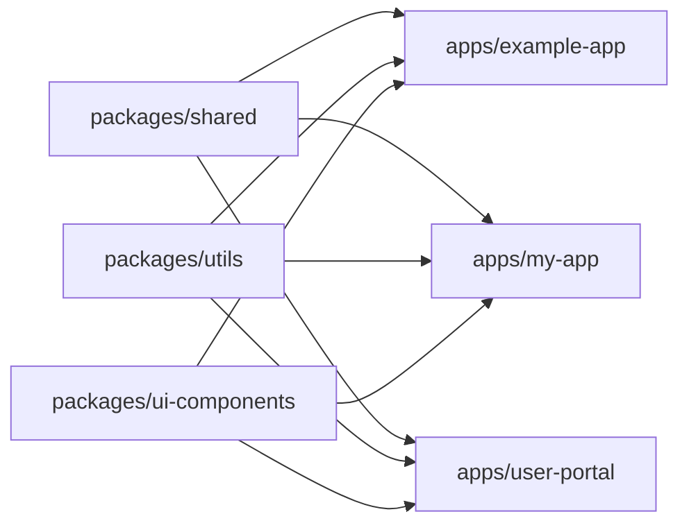

# Apps 目录

## 📖 目录

-   [📁 目录结构](#-目录结构)
-   [🎯 目录作用](#-目录作用)
-   [🤖 使用 AI 技能创建新应用](#-使用-ai-技能创建新应用)
-   [🚀 快速开始](#-快速开始)
-   [📋 应用结构](#-应用结构)
-   [⚙️ 配置文件说明](#️-配置文件说明)
-   [🔗 依赖管理](#-依赖管理)
-   [🛠️ 开发工作流](#️-开发工作流)
-   [🎨 自定义配置](#-自定义配置)
-   [🔍 调试技巧](#-调试技巧)
-   [📊 监控与优化](#-监控与优化)
-   [🚨 常见问题](#-常见问题)
-   [📚 更多资源](#-更多资源)

## 📁 目录结构

```
apps/
├── example-app/        # 示例应用（开发起点）
├── [your-app]/         # 你的应用（通过 AI 技能创建）
└── README.md           # 本文件
```

## 🎯 目录作用

`apps/` 目录用于存放独立的 Vue 3 H5 应用。每个应用都是一个完整的、可独立运行的项目，它们共享相同的项目配置和 monorepo 结构，但可以有不同的业务逻辑和页面功能。

### 主要特点：

-   **独立应用**：每个应用都是完整的 Vue 3 + TypeScript 项目
-   **共享配置**：继承根目录的 ESLint、Prettier、TypeScript 等配置
-   **热重载**：支持开发时的热模块替换（HMR）
-   **构建优化**：支持生产环境的代码分割和优化
-   **Monorepo 集成**：可以共享 packages 目录下的公共包

## 🤖 使用 AI 技能创建新应用

本项目内置了 AI 智能开发技能，可以快速创建新的 Vue 应用。

### 技能位置：

`./skills/create-vue-app/SKILL.md`

### 创建新应用的方式：

#### 方法 1：在 AI 编辑器中直接请求

```
"创建新的 Vue 应用，名称为 my-app"
"创建新应用，名称为 admin-panel，端口号为 8080"
"在 apps 目录下添加新应用 user-portal"
```

#### 方法 2：手动创建

如果你不使用 AI 编辑器，可以按照以下步骤创建新应用：

1. **复制示例应用**

```bash
cp -r apps/example-app apps/my-app
```

2. **修改应用配置**

    - 更新 `apps/my-app/package.json` 中的 `name` 字段
    - 更新 `apps/my-app/vue.config.js` 中的端口和标题配置
    - 根据需要修改路由、页面等代码

3. **更新根目录脚本** 在根目录的 `package.json` 中添加对应的运行脚本：

```json
{
    "scripts": {
        "dev:my-app": "./scripts/build-packages.sh --skip-clean && pnpm -F my-app dev",
        "build:my-app": "pnpm -F my-app build",
        "lint:my-app": "pnpm -F my-app lint"
    }
}
```

## 🚀 快速开始

### 1. 启动示例应用

```bash
# 启动 example-app 开发服务器（端口 2000）
pnpm dev:example

# 构建 example-app
pnpm build:example

# 代码检查
pnpm lint:example
```

### 2. 创建新应用后

假设你创建了一个名为 `my-app` 的应用：

```bash
# 安装依赖（如果需要）
pnpm install

# 启动新应用的开发服务器
pnpm dev:my-app

# 构建新应用
pnpm build:my-app

# 代码检查
pnpm lint:my-app
```

## 📋 应用结构

每个应用都包含以下标准结构：

```
apps/{app-name}/
├── src/
│   ├── App.tsx           # 应用入口组件
│   ├── main.ts          # 应用入口文件
│   ├── plugins/         # Vue 插件（Pinia、Router 等）
│   │   └── index.ts
│   ├── router/          # 路由配置
│   │   └── index.ts
│   └── views/           # 页面组件
│       ├── HomeView/
│       │   ├── index.tsx
│       │   └── style.module.less
│       └── AboutView/
│           ├── index.tsx
│           └── style.module.less
├── public/              # 静态资源
├── index.htm           # HTML 模板
├── favicon.ico        # 网站图标
├── package.json        # 应用配置
├── tsconfig.json      # TypeScript 配置
└── vue.config.js      # Vue CLI 配置
```

## ⚙️ 配置文件说明

### 1. `vue.config.js`

每个应用都有自己的 Vue 配置，主要包括：

-   **开发服务器配置**：端口、代理等
-   **Webpack 配置**：别名、插件、loader 配置
-   **CSS 配置**：Less 支持、CSS Modules 配置

### 2. `tsconfig.json`

TypeScript 配置，继承自根目录配置，包含：

-   JSX 支持（Vue 3 JSX）
-   路径别名（@/ 指向 src 目录）
-   类型检查规则

### 3. `package.json`

应用级别的依赖和脚本配置：

-   依赖 `@my-app/shared` 包（工作区引用）
-   开发脚本：dev、build、lint

## 🔗 依赖管理

### 1. 添加外部依赖

```bash
# 为 my-app 应用添加 lodash 依赖
pnpm -F my-app add lodash

# 为所有应用添加依赖
pnpm -r add lodash

# 移除特定应用的依赖
pnpm -F my-app remove lodash

# 添加开发依赖
pnpm -F my-app add -D @types/lodash

# 查看应用的依赖树
pnpm -F my-app list
```

### 2. 添加内部包依赖

当需要使用 `packages/` 目录下的共享包时，有两种方式：

#### 方式一：通过 package.json 添加（推荐）

在应用的 `package.json` 文件中添加依赖：

```json
{
    "dependencies": {
        "@my-app/shared": "workspace:*",
        "@my-app/utils": "workspace:*",
        "@my-app/ui-components": "workspace:*"
    }
}
```

#### 方式二：通过命令行添加

```bash
# 添加 packages 目录下的 shared 包
pnpm -F my-app add @my-app/shared

# 这会自动解析为 workspace:* 版本
```

### 3. 引用内部包

在应用代码中引用 packages 目录下的包：

```typescript
// 引用共享工具包
import { safeNum, formatDate } from '@my-app/shared';
import { formatCurrency } from '@my-app/utils';

// 引用组件库
import { Button, Modal } from '@my-app/ui-components';

// 引用工具函数集
import { login, logout } from '@my-app/auth';

// 使用示例
const price = safeNum('123.45');
const formattedDate = formatDate(new Date());
const formattedPrice = formatCurrency(price, 'USD');

// 在组件中使用
const handleLogin = async () => {
    const user = await login(username, password);
    console.log('登录成功:', user);
};
```

### 4. 工作区协议

项目使用 PNPM 工作区协议 (`workspace:*`) 来管理内部包依赖：

```json
{
    "dependencies": {
        "@my-app/shared": "workspace:*"
    }
}
```

这种方式的优势：

-   ✅ **始终使用最新版本**：总是引用本地最新的代码
-   ✅ **开发时热重载**：修改包代码后，应用会自动重新构建
-   ✅ **构建时优化**：Rollup 会正确处理工作区引用

### 5. 依赖构建顺序

当你修改了 packages 目录下的代码时：

```bash
# 先构建所有包
pnpm build:packages

# 然后启动应用开发服务器
pnpm dev:my-app

# 或者在根目录 package.json 中配置的脚本会自动处理构建顺序
# dev:my-app 脚本已经包含了构建包的步骤
```

### 6. 依赖版本冲突解决

如果出现依赖版本冲突：

```bash
# 查看冲突的依赖
pnpm why package-name

# 更新依赖版本到统一版本
pnpm -r up package-name@version

# 或者使用覆盖
pnpm -r add --save-exact package-name@version
```

## 🛠️ 开发工作流

### 1. 启动开发

```bash
# 进入应用目录
cd apps/my-app

# 或从根目录
pnpm -F my-app dev
```

### 2. 代码检查

```bash
# 代码检查和自动修复
pnpm -F my-app lint
```

### 3. 构建应用

```bash
# 生产环境构建
pnpm -F my-app build

# 构建产物位于 apps/my-app/dist/
```

### 4. 部署应用

构建产物可以直接部署到任何静态文件服务器或 CDN。

## 🎨 自定义配置

### 修改端口

编辑应用的 `vue.config.js` 文件：

```javascript
// vue.config.js
devServer: {
  port: 3000, // 修改为你想要的端口
}
```

### 修改应用标题

编辑应用的 `vue.config.js` 文件：

```javascript
// vue.config.js
getHtmlPluginConfig: (defaultConfig = {}) => {
    return {
        ...defaultConfig,
        title: '我的应用名称', // 修改应用标题
    };
};
```

### 添加新页面

1. 在 `src/views/` 目录下创建新的页面组件
2. 在 `src/router/index.ts` 中添加路由配置
3. 页面会自动支持懒加载

## 🔍 调试技巧

### 1. 查看构建分析

```bash
pnpm -F my-app build --report
```

### 2. 检查依赖

```bash
# 查看应用的依赖树
pnpm -F my-app list

# 检查是否有未使用的依赖
npx depcheck
```

### 3. 性能分析

使用 Vue Devtools 进行组件性能分析。

## 📊 监控与优化

### 1. 包大小分析

```bash
# 分析应用打包体积
pnpm -F my-app build --report
```

### 2. 性能优化建议

-   使用动态导入实现代码分割
-   使用 `keep-alive` 缓存组件
-   避免在 `computed` 中进行复杂计算
-   使用 `v-memo` 优化渲染性能

## 🚨 常见问题

### 1. 端口已被占用

错误信息：`Port 3000 is already in use`

解决方案：

-   修改 `vue.config.js` 中的端口号
-   或者停止占用该端口的进程

### 2. 依赖安装失败

```bash
# 清理 node_modules 并重新安装
rm -rf node_modules
rm -rf apps/*/node_modules
pnpm i
```

### 3. 类型检查错误

```bash
# 检查 TypeScript 类型错误
pnpm -F my-app type-check

# 或者使用
npx tsc --noEmit
```

### 4. 热重载不工作

-   检查浏览器是否支持 WebSocket
-   检查防火墙设置
-   尝试禁用某些浏览器扩展

## 📚 更多资源

### 官方文档

-   [Vue 3 官方文档](https://vuejs.org/)
-   [Vue Router](https://router.vuejs.org/)
-   [Pinia](https://pinia.vuejs.org/)
-   [Vite](https://vitejs.dev/)

### 项目内资源

-   📖 **示例代码**：查看 `example-app` 目录
-   🤖 **AI 技能**：使用 `create-vue-app` 技能快速创建应用
-   ⚙️ **配置参考**：参考现有应用的配置文件

---

## 🎯 总结

`apps/` 目录是 Vue H5 Monorepo 项目的核心，它提供：

1. **快速启动**：使用 AI 技能快速创建新应用
2. **代码复用**：轻松引用 `packages/` 目录下的共享包
3. **独立开发**：每个应用都有完整的开发环境
4. **统一配置**：继承项目的最佳实践配置
5. **高效协作**：支持团队并行开发不同应用

## 🔄 工作流程示例

### 创建新应用并引用共享包

```bash
# 1. 创建新应用
# 使用 AI 技能： "创建新的 Vue 应用，名称为 user-portal，端口号为 3000"

# 2. 添加共享包依赖
cd apps/user-portal
pnpm add @my-app/shared @my-app/utils

# 3. 启动开发服务器
pnpm dev:user-portal

# 4. 在代码中使用共享包
# 在 src/views/HomeView/index.tsx 中：
# import { safeNum } from '@my-app/shared';
# import { formatCurrency } from '@my-app/utils';
```

### 与 packages 目录协作



**开始你的应用开发之旅！** 🚀

> 💡 **提示**：
>
> 1. 建议先从 `example-app` 开始学习
> 2. 使用 AI 技能 `create-vue-app` 快速创建新应用
> 3. 充分利用 `packages/` 目录的共享代码
> 4. 参考本指南解决开发中的常见问题
