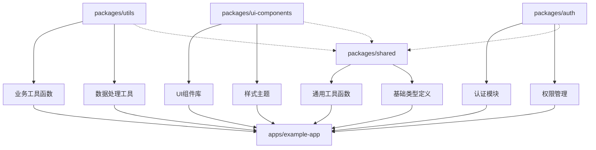

# Packages 目录

## 📖 目录

-   [📁 目录结构](#-目录结构)
-   [🎯 目录作用](#-目录作用)
-   [🤖 使用 AI 技能创建新依赖包](#-使用-ai-技能创建新依赖包)
-   [🚀 快速开始](#-快速开始)
-   [📋 包结构](#-包结构)
-   [⚙️ 配置文件说明](#️-配置文件说明)
-   [🔧 开发工作流](#-开发工作流)
-   [📦 包类型详解](#-包类型详解)
-   [🔗 依赖管理](#-依赖管理)
-   [🧪 测试指南](#-测试指南)
-   [📝 文档规范](#-文档规范)
-   [🚀 最佳实践](#-最佳实践)
-   [🔍 调试技巧](#-调试技巧)
-   [📊 性能优化](#-性能优化)
-   [🚨 常见问题](#-常见问题)
-   [📚 更多资源](#-更多资源)

## 📁 目录结构

```
packages/
├── shared/           # 共享工具包示例
├── [your-package]/  # 你的依赖包（通过 AI 技能创建）
└── README.md        # 本文件
```

## 🎯 目录作用

`packages/` 目录用于存放可复用的依赖包。这些包可以被 `apps/` 目录下的所有应用共享和引用，实现了代码的模块化和复用。

### 主要特点：

-   **代码复用**：将通用功能提取为独立的包，避免重复代码
-   **版本控制**：每个包可以独立版本管理
-   **类型安全**：完整的 TypeScript 支持
-   **构建优化**：支持 Tree-shaking 和按需加载
-   **Monorepo 集成**：通过工作区协议（workspace:\*）引用

## 🤖 使用 AI 技能创建新依赖包

本项目内置了 AI 智能开发技能，可以快速创建不同类型的依赖包。

### 技能位置：

`./skills/create-a-package/SKILL.md`

### 支持创建的包类型：

1. **工具库 (Utility Library)**

    - 包含通用的工具函数（如日期处理、数字处理等）
    - 无框架依赖，纯 TypeScript/JavaScript

2. **组件库 (Component Library)**

    - 包含可复用的 Vue 3 组件
    - 依赖 Vue 3.x 和 JSX 支持

3. **工具函数集 (Helper Functions)**

    - 针对特定业务场景的工具函数集合
    - 如认证、HTTP 请求、表单验证等

4. **插件库 (Plugin Library)**
    - Vue 插件或通用插件
    - 如路由守卫、状态管理插件等

### 创建新包的方式：

#### 方法 1：在 AI 编辑器中直接请求

```
"创建新的依赖包，名称为 utils，类型为工具库"
"创建新的组件库，名称为 ui-components"
"在 packages 目录下添加新包 auth-helpers，类型为工具函数集，描述为 '用户认证相关工具函数'"
```

#### 方法 2：交互式创建

AI 技能会引导你完成创建过程：

1. **询问包名**：

    ```
    请输入包名称（例如：utils、ui-components、auth）：
    ```

2. **确认作用域**：

    ```
    是否使用 @my-app/ 作用域前缀？(y/n):
    ```

3. **询问包描述**：

    ```
    请输入包的简要描述（可选）：
    ```

4. **选择包类型**：

    ```
    请选择包类型：
    1) 工具库（纯工具函数）
    2) 组件库（Vue 组件）
    3) 工具函数集（业务相关函数）
    4) 插件库（Vue 插件）
    请输入数字选择：
    ```

5. **询问是否添加测试**：
    ```
    是否添加测试支持？(y/n):
    ```

#### 方法 3：手动创建

如果你不使用 AI 编辑器，可以参考现有 `shared` 包的结构：

1. **创建包目录**

    ```bash
    mkdir -p packages/my-package
    cd packages/my-package
    ```

2. **初始化包配置**

    ```bash
    # 创建 package.json
    cat > package.json << 'EOF'
    {
      "name": "@my-app/my-package",
      "version": "1.0.0",
      "description": "我的工具包",
      "main": "dist/index.js",
      "types": "dist/index.d.ts",
      "exports": {
        ".": {
          "import": "./dist/index.js",
          "require": "./dist/index.js"
        }
      },
      "scripts": {
        "clean": "rimraf dist",
        "prebuild": "pnpm run clean",
        "build": "rollup -c rollup.config.ts --configPlugin typescript",
        "dev": "rollup -c rollup.config.ts --configPlugin typescript --watch"
      },
      "keywords": [],
      "author": "",
      "license": "MIT",
      "peerDependencies": {},
      "devDependencies": {},
      "engines": {
        "node": ">= 14"
      }
    }
    EOF
    ```

3. **复制配置文件** 从 `packages/shared/` 复制 `tsconfig.json`、`tsconfig.build.json` 和 `rollup.config.ts`

4. **创建源码结构**
    ```bash
    mkdir -p src
    ```

## 🚀 快速开始

### 1. 使用现有 shared 包

```bash
# 构建 shared 包
pnpm build:shared

# 运行 shared 包测试
pnpm test:shared

# 开发模式（监听文件变化）
cd packages/shared && pnpm run dev
```

### 2. 创建新包后

假设你创建了一个名为 `utils` 的包：

```bash
# 进入包目录
cd packages/utils

# 开发模式
pnpm run dev

# 构建生产版本
pnpm run build

# 运行测试（如果添加了测试）
pnpm test
```

### 3. 在其他应用中引用和使用

创建包后，你可以在 `apps/` 目录下的应用中使用它。以下是完整的步骤：

#### 步骤 1: 在应用中添加包依赖

在应用的 `package.json` 中添加包依赖：

```json
{
    "dependencies": {
        "@my-app/utils": "workspace:*",
        "@my-app/shared": "workspace:*"
    }
}
```

或者使用命令行添加：

```bash
# 在 my-app 应用中添加 utils 包依赖
pnpm -F my-app add @my-app/utils
```

#### 步骤 2: 在应用中导入和使用

```typescript
// 在 Vue 组件或工具文件中导入
import { safeNum, formatDate } from '@my-app/utils';
import { formatCurrency } from '@my-app/utils/currency';
import { Button, Modal } from '@my-app/ui-components';

// 在 Vue 组件中使用
export default defineComponent({
    setup() {
        // 使用工具函数
        const price = safeNum('123.45');
        const formattedDate = formatDate(new Date());
        const formattedPrice = formatCurrency(price, 'USD');

        return () => (
            <div>
                <h1>使用共享包示例</h1>
                <p>价格: {formattedPrice}</p>
                <p>日期: {formattedDate}</p>
                {/* 使用组件库 */}
                <Button onClick={() => console.log('点击')}>提交</Button>
                <Modal visible={true}>内容</Modal>
            </div>
        );
    },
});
```

#### 步骤 3: 配置 TypeScript 路径映射（已自动配置）

创建包时，TypeScript 配置已自动设置路径映射。检查应用的 `tsconfig.json`：

```json
{
    "compilerOptions": {
        "paths": {
            "@my-app/shared": ["../../packages/shared/dist/index"],
            "@my-app/*": ["../../packages/*/dist/index"]
        }
    }
}
```

#### 步骤 4: 构建和开发

```bash
# 1. 构建所有包（确保包已构建）
pnpm build:packages

# 2. 启动应用开发服务器（会自动重新构建依赖的包）
pnpm dev:my-app

# 或者在包的开发模式下工作
cd packages/utils && pnpm run dev
# 这会监听包文件变化，自动重新构建
```

#### 步骤 5: 处理类型声明

包的 TypeScript 类型声明会自动包含在构建产物中。确保：

1. 包已正确构建：`pnpm run build`
2. 包的 `dist/index.d.ts` 文件存在
3. 在应用中正确导入类型

### 4. 工作区引用机制

项目使用 PNPM Workspace 的 `workspace:*` 协议来引用内部包：

```json
{
    "dependencies": {
        "@my-app/utils": "workspace:*"
    }
}
```

**优势**：

-   ✅ **本地开发优先**：始终使用本地代码，而不是 npm 上的版本
-   ✅ **实时更新**：修改包代码后，应用会自动感知并重新构建
-   ✅ **版本一致**：避免了版本冲突问题
-   ✅ **构建优化**：Rollup 可以正确处理工作区引用

### 5. 常见使用场景示例

#### 场景 1: 工具函数库

```typescript
// 在应用的 utils 文件中使用
import { formatDate, formatCurrency, debounce, throttle } from '@my-app/utils';

// 在业务代码中使用
export function processData(data: any) {
    const price = formatCurrency(data.price, 'CNY');
    const date = formatDate(new Date(data.timestamp), 'YYYY-MM-DD HH:mm:ss');
    return { price, date };
}
```

#### 场景 2: 组件库

```typescript
// 在 Vue 组件中使用
import { Button, Input, Select, Modal, Table } from '@my-app/ui-components';

export default defineComponent({
    components: {
        Button,
        Input,
        Select,
        Modal,
        Table,
    },
    setup() {
        // 组件逻辑
    },
});
```

#### 场景 3: 业务工具集

```typescript
// 在业务模块中使用
import { login, logout, getCurrentUser, hasPermission } from '@my-app/auth';

import { request, uploadFile, downloadFile } from '@my-app/http';

// 在页面逻辑中使用
export async function handleUserLogin(credentials) {
    try {
        const user = await login(credentials);
        if (hasPermission(user, 'admin')) {
            // 管理员操作
        }
        return user;
    } catch (error) {
        console.error('登录失败:', error);
    }
}
```

#### 场景 4: 插件库

```typescript
// 在应用入口文件中使用
import { createApp } from 'vue';
import { analyticsPlugin } from '@my-app/analytics';
import { i18nPlugin } from '@my-app/i18n';

const app = createApp(App);

// 安装插件
app.use(analyticsPlugin, {
    trackingId: 'UA-XXXXX-Y',
});

app.use(i18nPlugin, {
    locale: 'zh-CN',
    messages: {
        // 翻译信息
    },
});

app.mount('#app');
```

### 6. 调试技巧

#### 查看包的构建产物

```bash
# 查看包的构建输出
cd packages/utils
ls dist/
# index.js      # 编译后的 JavaScript
# index.d.ts    # TypeScript 类型声明
# index.js.map  # Source Map 文件
```

#### 检查包的依赖树

```bash
# 查看包的依赖关系
pnpm -F @my-app/utils list

# 查看哪些应用依赖了该包
pnpm why @my-app/utils
```

#### 开发模式下的热重载

```bash
# 在包目录启动开发模式（监听文件变化）
cd packages/utils
pnpm run dev

# 在另一个终端启动应用
cd apps/my-app
pnpm run dev

# 修改包代码，应用会自动重新构建并热重载
```

#### 类型检查

```bash
# 检查包的类型定义
cd packages/utils
npx tsc --noEmit

# 检查应用中的类型引用
cd apps/my-app
npx tsc --noEmit
```

### 7. 常见问题解决

#### 问题 1: 找不到模块 '@my-app/utils'

```
Error: Cannot find module '@my-app/utils'
```

**解决方案**:

```bash
# 确保包已构建
cd packages/utils && pnpm run build

# 或者构建所有包
pnpm build:packages

# 重新安装依赖
pnpm i --force
```

#### 问题 2: 类型声明错误

```
TS2307: Cannot find module '@my-app/utils' or its corresponding type declarations.
```

**解决方案**:

1. 检查包的 `dist/index.d.ts` 文件是否存在
2. 确保包的 `package.json` 中有正确的 `types` 字段
3. 重新构建包：`pnpm run build`

#### 问题 3: 版本冲突

```
版本不匹配错误
```

**解决方案**:

```bash
# 更新所有包到相同版本
pnpm -r up package-name@version

# 或者使用版本覆盖
pnpm -F my-app add package-name@version
```

## 📋 包结构

每个包都包含以下标准结构：

```
packages/{package-name}/
├── src/
│   ├── index.ts          # 包的主入口文件
│   ├── utils/            # 工具函数目录
│   ├── components/       # Vue 组件目录（如果是组件库）
│   ├── types/            # 类型定义目录
│   └── ...              # 其他源码目录
├── __tests__/           # 测试目录（可选）
│   ├── index.test.ts    # 测试文件
│   └── ...              # 其他测试文件
├── dist/                # 构建产物目录
│   ├── index.js         # 编译后的 JavaScript
│   ├── index.d.ts       # 类型声明文件
│   └── index.js.map     # Source Map
├── README.md            # 包的说明文档
├── package.json         # 包配置文件
├── rollup.config.ts     # Rollup 构建配置
├── tsconfig.json        # TypeScript 开发配置
├── tsconfig.build.json  # TypeScript 构建配置
└── jest.config.js       # Jest 测试配置（如果添加了测试）
```

## ⚙️ 配置文件说明

### 1. `package.json`

包的主要配置文件：

-   **name**: 包名，建议使用 `@my-app/` 作用域前缀
-   **version**: 版本号，遵循语义化版本控制
-   **main**: CommonJS 入口文件
-   **types**: TypeScript 类型声明文件
-   **exports**: ES 模块导出配置
-   **scripts**: 构建、测试等脚本
-   **peerDependencies**: 运行时依赖
-   **devDependencies**: 开发依赖

### 2. `rollup.config.ts`

Rollup 构建配置：

-   **ESM 输出**: 生成 ES 模块格式
-   **类型声明**: 自动生成 .d.ts 文件
-   **Source Map**: 支持调试
-   **外部依赖**: 避免重复打包

### 3. `tsconfig.json`

TypeScript 开发配置：

-   **JSX 支持**: 支持 Vue 3 JSX 语法
-   **严格模式**: 启用严格类型检查
-   **路径映射**: 支持 @/ 别名

### 4. `tsconfig.build.json`

TypeScript 构建配置：

-   **只生成声明**: 仅输出 .d.ts 文件
-   **排除测试文件**: 不包含测试文件
-   **临时目录**: 输出到临时目录供 Rollup 处理

## 🔧 开发工作流

### 1. 本地开发

```bash
# 进入包目录
cd packages/my-package

# 开发模式（监听文件变化）
pnpm run dev

# 在另一个终端中，在应用中引用并测试
# 修改会自动热重载
```

### 2. 构建发布

```bash
# 构建生产版本
pnpm run build

# 构建产物位于 dist/ 目录
ls dist/
# index.js      # ES 模块
# index.d.ts    # 类型声明
# index.js.map  # Source Map
```

### 3. 测试

```bash
# 运行测试
pnpm test

# 测试并监听变化
pnpm test:watch

# 生成测试覆盖率报告
pnpm test:coverage
```

### 4. 发布到 npm（可选）

```bash
# 登录 npm
npm login

# 发布包
npm publish --access public
```

## 📦 包类型详解

### 1. 工具库 (Utility Library)

**特点**：

-   纯函数，无副作用
-   无框架依赖
-   通用工具函数

**示例**：

```typescript
// src/utils/math.ts
export function sum(a: number, b: number): number {
    return a + b;
}

export function formatNumber(num: number, decimals = 2): string {
    return num.toFixed(decimals);
}
```

### 2. 组件库 (Component Library)

**特点**：

-   包含 Vue 3 组件
-   支持 JSX/TSX
-   包含样式和类型定义

**示例**：

```tsx
// src/components/Button/index.tsx
import { defineComponent } from 'vue';

export const Button = defineComponent({
    name: 'Button',
    props: {
        type: {
            type: String as () => 'primary' | 'secondary',
            default: 'primary',
        },
    },
    setup(props, { slots }) {
        return () => <button class={`btn btn-${props.type}`}>{slots.default?.()}</button>;
    },
});
```

### 3. 工具函数集 (Helper Functions)

**特点**：

-   针对特定业务场景
-   可能依赖特定框架或库
-   包含业务逻辑

**示例**：

```typescript
// src/auth/index.ts
import type { User } from './types';

export function login(username: string, password: string): Promise<User> {
    // 登录逻辑
}

export function logout(): void {
    // 登出逻辑
}

export function getCurrentUser(): User | null {
    // 获取当前用户
}
```

### 4. 插件库 (Plugin Library)

**特点**：

-   Vue 插件或通用插件
-   全局功能扩展
-   配置选项支持

**示例**：

```typescript
// src/plugins/analytics.ts
import type { App } from 'vue';

export interface AnalyticsPluginOptions {
    trackingId: string;
}

export const analyticsPlugin = {
    install(app: App, options: AnalyticsPluginOptions) {
        // 初始化分析
        app.provide('analytics', {
            track(event: string, data?: any) {
                // 跟踪事件
            },
        });
    },
};
```

## 🔗 依赖管理

### 1. 包间依赖

```json
{
    "name": "@my-app/utils",
    "dependencies": {
        "@my-app/shared": "workspace:*" // 引用其他内部包
    }
}
```

### 2. 外部依赖

```json
{
    "name": "@my-app/ui-components",
    "peerDependencies": {
        "vue": "^3.5.33", // 运行时依赖
        "lodash": "^4.17.21" // 工具函数
    },
    "devDependencies": {
        "@types/lodash": "^4.17.21" // 开发时类型定义
    }
}
```

### 3. 版本控制

-   使用语义化版本控制 (SemVer)
-   主版本号：不兼容的 API 修改
-   次版本号：向下兼容的功能性新增
-   修订号：向下兼容的问题修正

## 🧪 测试指南

### 1. 测试框架

项目使用 Jest 作为测试框架，支持：

-   TypeScript 测试
-   Vue 组件测试
-   快照测试
-   覆盖率报告

### 2. 测试配置

```javascript
// jest.config.js
module.exports = {
    preset: 'ts-jest',
    testEnvironment: 'jsdom', // 或 'node'
    roots: ['<rootDir>/src'],
    testMatch: ['**/__tests__/**/*.ts', '**/?(*.)+(spec|test).ts'],
    transform: {
        '^.+\\.ts$': 'ts-jest',
    },
    collectCoverageFrom: ['src/**/*.ts', '!src/**/*.d.ts'],
};
```

### 3. 测试示例

```typescript
// __tests__/utils.test.ts
import { sum, formatNumber } from '../src/utils/math';

describe('数学工具函数', () => {
    describe('sum', () => {
        it('应该正确计算两个数的和', () => {
            expect(sum(1, 2)).toBe(3);
            expect(sum(-1, 1)).toBe(0);
            expect(sum(0, 0)).toBe(0);
        });
    });

    describe('formatNumber', () => {
        it('应该格式化数字到指定小数位', () => {
            expect(formatNumber(3.14159, 2)).toBe('3.14');
            expect(formatNumber(100, 0)).toBe('100');
            expect(formatNumber(0.5, 4)).toBe('0.5000');
        });
    });
});
```

### 4. Vue 组件测试

```typescript
// __tests__/components/Button.test.tsx
import { mount } from '@vue/test-utils';
import { Button } from '../../src/components/Button';

describe('Button组件', () => {
    it('渲染默认按钮', () => {
        const wrapper = mount(Button, {
            slots: {
                default: '点击我',
            },
        });

        expect(wrapper.text()).toBe('点击我');
        expect(wrapper.classes()).toContain('btn');
    });
});
```

## 📝 文档规范

### 1. README.md

每个包必须有完整的 README.md，包含：

-   **安装说明**: 如何安装和使用
-   **使用示例**: 代码示例
-   **API 文档**: 所有导出项的详细说明
-   **开发指南**: 如何贡献和开发
-   **许可证信息**: 开源许可证

### 2. JSDoc 注释

```typescript
/**
 * 安全地将输入值转换为数字
 * @param inputValue - 要转换的值
 * @returns 转换后的数字，如果转换失败则返回 0
 * @example
 * safeNum('123') // 123
 * safeNum('abc') // 0
 * safeNum(null)  // 0
 */
export function safeNum(inputValue: unknown): number {
    let res = Number(inputValue);
    if (Number.isNaN(res)) {
        res = 0;
    }
    return res;
}
```

### 3. 类型定义

```typescript
// src/types/index.ts
export interface User {
    id: number;
    name: string;
    email: string;
}

export interface PaginationParams {
    page: number;
    pageSize: number;
    total: number;
}
```

## 🚀 最佳实践

### 1. 单一职责

-   每个包只负责一个明确的功能领域
-   避免创建功能过于复杂的大包
-   考虑将大包拆分为多个小包

### 2. 最小化依赖

-   只引入必要的依赖
-   使用 `peerDependencies` 声明运行时依赖
-   避免依赖链过长

### 3. 类型安全

-   提供完整的 TypeScript 类型定义
-   使用泛型增强类型推断
-   避免使用 `any` 类型

### 4. 向后兼容

-   保持 API 的稳定性
-   使用语义化版本控制
-   废弃 API 时提供迁移指南

### 5. 文档完整

-   提供清晰的安装和使用说明
-   包含完整的 API 文档
-   提供使用示例

## 🔍 调试技巧

### 1. 构建调试

```bash
# 查看详细构建日志
pnpm run build --verbose

# 只生成类型声明
npx tsc -p tsconfig.build.json
```

### 2. 测试调试

```bash
# 运行单个测试文件
pnpm test -- src/utils/math.test.ts

# 调试模式
pnpm test --inspect-brk

# 只运行特定测试
pnpm test -- -t "sum function"
```

### 3. 源码调试

```typescript
// 使用 debugger 语句
export function complexFunction() {
    debugger; // 调试器会在这里暂停
    // ... 复杂逻辑
}

// 使用 console.log 调试
console.log('调试信息:', { data });
```

## 📊 性能优化

### 1. 包大小优化

-   使用 Tree-shaking 友好的导出方式
-   避免不必要的依赖
-   按需导入大型库

### 2. 构建优化

-   使用 Rollup 的代码分割
-   压缩和混淆代码
-   移除调试信息

### 3. 缓存优化

-   使用合理的缓存策略
-   避免频繁的重复计算
-   使用 memoization 技术

## 🚨 常见问题

### 1. 类型错误

**错误**: `Cannot find module '@my-app/utils'`

**解决方案**:

```bash
# 确保包已构建
pnpm build:packages

# 重新安装依赖
pnpm i --force
```

### 2. 循环依赖

**错误**: `Circular dependency detected`

**解决方案**:

-   重构包结构，消除循环依赖
-   使用接口或抽象层解耦
-   考虑合并相关包

### 3. 版本冲突

**错误**: `版本不兼容`

**解决方案**:

-   统一所有包的依赖版本
-   使用 peerDependencies 声明兼容版本
-   使用 workspaces 协议确保版本一致

### 4. 构建失败

```bash
# 清理构建缓存
rm -rf dist node_modules/.cache

# 重新构建
pnpm run clean && pnpm run build

# 检查 TypeScript 错误
npx tsc --noEmit
```

## 📚 更多资源

### 官方文档

-   [TypeScript 手册](https://www.typescriptlang.org/docs/)
-   [Rollup 文档](https://rollupjs.org/)
-   [Jest 文档](https://jestjs.io/)
-   [Semantic Versioning](https://semver.org/)

### 项目内资源

-   📖 **示例代码**: 查看 `shared` 包的实现
-   🤖 **AI 技能**: 使用 `create-a-package` 技能快速创建包
-   ⚙️ **配置参考**: 参考现有包的配置文件
-   🧪 **测试示例**: 查看 `shared` 包的测试文件

---

## 🎯 总结

`packages/` 目录是 Vue H5 Monorepo 项目的共享代码库，它提供：

1. **代码复用**：将通用功能提取为独立的包，避免重复代码
2. **类型安全**：完整的 TypeScript 支持和类型推断
3. **构建优化**：支持 Tree-shaking 和按需加载
4. **版本控制**：每个包可以独立版本管理和发布
5. **开发效率**：支持热重载和实时更新

## 🔄 开发流程示例

### 创建工具包并在应用中使用

```bash
# 1. 创建新工具包
# 使用 AI 技能： "创建新的依赖包，名称为 utils，类型为工具库，描述为 '通用工具函数库'"

# 2. 开发工具包
cd packages/utils
# 编辑 src/index.ts 添加工具函数
pnpm run dev  # 开发模式，监听文件变化

# 3. 构建工具包
pnpm run build  # 生产构建，生成 dist/ 目录

# 4. 在应用中引用
cd apps/my-app
pnpm add @my-app/utils  # 添加依赖

# 5. 在应用代码中使用
# import { formatDate, debounce } from '@my-app/utils';
```

### 包间协作关系



### 最佳实践建议

1. **单一职责**：每个包只解决一个问题
2. **小而美**：保持包的轻量和专注
3. **完整文档**：每个包都要有详细的 README 和 API 文档
4. **充分测试**：确保包的稳定性和可靠性
5. **向后兼容**：保持 API 的稳定性，遵循语义化版本

**开始你的包开发之旅！** 🚀

> 💡 **提示**：
>
> 1. 建议先从 `shared` 包开始学习包的结构和配置
> 2. 使用 AI 技能 `create-a-package` 快速创建新包
> 3. 遵循"单一职责"原则，每个包专注于一个特定领域
> 4. 充分利用 TypeScript 的类型系统，提供完整的类型定义
> 5. 参考本指南解决包开发中的常见问题
